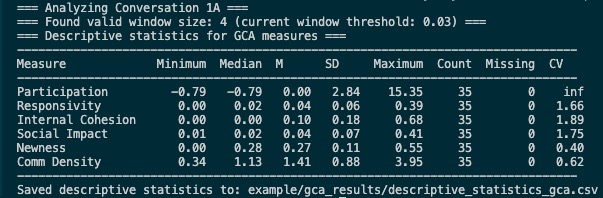

Getting Started
===============

This guide will help you get started with GCA Analyzer quickly.

Prerequisites
------------

Before installing GCA Analyzer, ensure you have:

* Python 3.12 or higher
* pip package manager
* Basic understanding of conversation analysis concepts

Installation
------------

Install GCA Analyzer using pip:

.. code-block:: bash

   pip install gca_analyzer

Quick Start
----------

Here's a simple example to analyze a group conversation:

.. code-block:: python

   from gca_analyzer import GCAAnalyzer
   
   # Initialize the analyzer
   analyzer = GCAAnalyzer()
   
   # Load and analyze data
   metrics = analyzer.analyze_conversation('conversation_1', data)
   print(metrics)

2. Command Line Usage:

.. code-block:: bash

   python -m gca_analyzer --data your_data.csv

Input Data Format
---------------

The input data should be a CSV file with the following columns:

- ``conversation_id``: Identifier for the conversation
- ``person_id``: Identifier for each participant
- ``text``: The actual message content
- ``time``: Timestamp of the message

Configuration Options
------------------

Command line arguments:

- ``--data``: Path to input data file (required)
- ``--output``: Output directory for results (default: ``gca_results``)
- ``--best-window-indices``: Window size optimization threshold (default: 0.3)
  - Range: 0.0-1.0
  - Sparse conversations may benefit from smaller thresholds
- ``--console-level``: Logging level (default: INFO)
  - Options: DEBUG, INFO, WARNING, ERROR, CRITICAL
- ``--model-name``: LLM model for text processing
  - Default: sentence-transformers/paraphrase-multilingual-MiniLM-L12-v2

Example Results
-------------

After running the analysis, you'll get metrics including:

- Participation patterns
- Internal cohesion
- Overall responsivity
- Social impact
- Content newness
- Communication density

Metrics information can be found in the :doc:`mathematics` section.