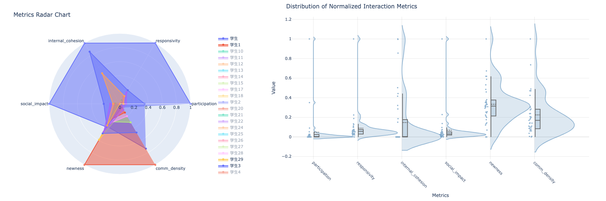

Getting Started
===============

This guide will help you get started with GCA Analyzer quickly.

New! Try it Online with Google Colab or ModelScope
-----------------------------------------------------

.. image:: https://colab.research.google.com/assets/colab-badge.svg
   :target: https://colab.research.google.com/drive/11TC3wzCmP0r2axRUc1FuyWOBiZS1j-Qg?usp=sharing
   :alt: Open in Colab

.. image:: https://img.shields.io/badge/ModelScope-Run%20in%20Community-blue?logo=appveyor
   :target: https://modelscope.cn/notebook/share/ipynb/9d562da5/base_usage.ipynb.ipynb
   :alt: Open in ModelScope

For immediate hands-on experience, click the Colab or ModelScope badge above to run GCA Analyzer directly in your browser without any installation.

--------------

Prerequisites
--------------

Before installing GCA Analyzer, ensure you have:

* Python 3.9 or higher
* pip package manager
* Basic understanding of communication analysis concepts

Installation
------------

Install GCA Analyzer using pip:

.. code-block:: bash

   pip install gca-analyzer

Sample Data
-----------

GCA Analyzer includes built-in sample data to help you get started quickly. The sample data contains:

* **3 different conversations**: team_meeting, design_review, brainstorm
* **61 realistic conversation messages**
* **10 different participants** (Alice, Bob, Charlie, Diana, Emma, Kate, Lisa, Mike, Sarah, Tom)
* **Diverse conversation patterns** showing different communication dynamics

To preview the sample data:

.. code-block:: bash

   python -m gca_analyzer --sample-data --preview

This will show you a summary of the data including the number of conversations, participants, and a preview of the first few rows.

Input Data Format
------------------

The input data should be a CSV file with the following columns:

- ``conversation_id``: Identifier for the conversation
- ``person_id``: Identifier for each participant
- ``text``: The actual message content
- ``time``: Timestamp of the message

Quick Start
------------

The fastest way to get started is using the built-in sample data:

.. code-block:: bash

   # Use built-in sample data
   python -m gca_analyzer --sample-data

   # Preview the sample data first
   python -m gca_analyzer --sample-data --preview

   # Interactive mode (recommended for beginners)
   python -m gca_analyzer --interactive

If you have your own data, you can use it instead:

.. code-block:: bash

   python -m gca_analyzer --data your_data.csv

Python API Usage:

.. code-block:: python

   import pandas as pd
   from gca_analyzer import GCAAnalyzer
   
   # Initialize the analyzer
   analyzer = GCAAnalyzer()
   
   # Load and analyze data
   data = pd.read_csv('your_data.csv')
   # Analyze a specific conversation
   for conversation_id in data['conversation_id'].unique():
       metrics = analyzer.analyze_conversation(conversation_id, data)
       print(f"Metrics for {conversation_id}: {metrics}")

Configuration Options
----------------------

Command line arguments:

- ``--help``: Show help message and exit
- ``--sample-data``: Use built-in sample data for quick testing
- ``--preview``: Preview the sample data before analysis
- ``--interactive``: Start interactive mode for guided analysis
- ``--data``: Path to input data file (required)
- ``--output``: Output directory for results (default: ``gca_results``)
- ``--best-window-indices``: Window size optimization threshold (default: 0.3)
  - Range: 0.0-1.0
  - Sparse conversations may benefit from smaller thresholds
- ``--console-level``: Logging level (default: INFO)
  - Options: DEBUG, INFO, WARNING, ERROR, CRITICAL
- ``--model-name``: LLM model for text processing
  - Default: sentence-transformers/paraphrase-multilingual-MiniLM-L12-v2

Example Results
----------------

After the analysis is complete, you will receive each person's values and descriptive statistics for the following metrics:

- Participation patterns
- Internal cohesion
- Overall responsivity
- Social impact
- Content newness
- Communication density

.. image:: _static/gca_results.jpg
   :alt: Example Results
   :align: center

you'll get interactive and informative visualizations for key GCA measures:

- **Radar Plots**: Compare multiple measures across participants
- **Distribution Plots**: Visualize the distribution of measures

Results are saved as interactive HTML files in the specified output directory, allowing for easy exploration and sharing of analysis outcomes.

Metrics information can be found in the :doc:`mathematics` section.