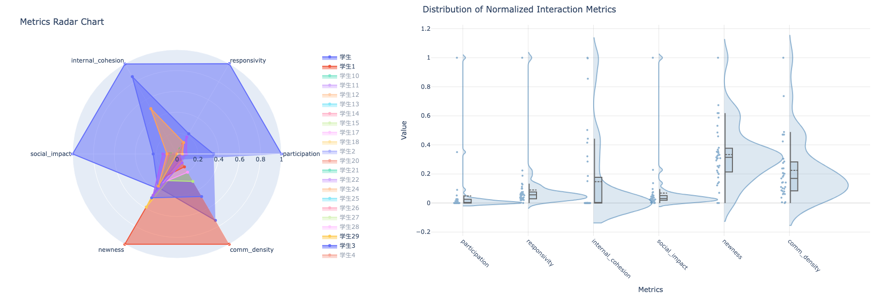

# Summary

Group conversation analysis is crucial for understanding social dynamics, learning behaviors, and communication patterns in various settings, particularly in educational contexts. The GCA Analyzer is a Python package that implements a comprehensive set of metrics and methods for analyzing group conversations, with special emphasis on Chinese text processing capabilities. This tool provides quantitative measures for participation patterns, interaction dynamics, content novelty, and communication density, making it especially valuable for researchers in education, social psychology, and communication studies.   
The GCA Analyzer builds upon foundational work in group cognition analysis and computational approaches to group communication [@dowell2019group, @wang2025role]. These works provide essential frameworks for understanding how participants interact and contribute in group discussions.

# Statement of Need

The analysis of group conversations is crucial in various fields, particularly in educational research, organizational behavior studies, and online learning environments. While several tools exist for conversation analysis, there is a significant gap in tools that can effectively handle multilingual text and provide comprehensive interaction metrics. Existing tools like ...

The GCA Analyzer addresses these gaps by providing:

1. Robust participation analysis through participation matrices
2. Temporal interaction analysis using sliding windows
3. Content similarity and novelty metrics
4. Social impact and responsivity measurements
5. Visualization capabilities for interaction patterns

These features enable researchers to conduct detailed analyses of group conversations, MOOC interactions, and cross-cultural communication patterns, supporting both research and practical applications in various educational and social contexts. By providing a comprehensive toolkit for quantitative analysis of group dynamics, the GCA Analyzer facilitates deeper insights into collaborative learning processes, team communication effectiveness, and the evolution of ideas within group discussions.

# Installation

Install GCA Analyzer using pip:

```bash
pip install gca-analyzer
```

# Quick Start

Here's a simple example to analyze a group conversation:

```python
from gca_analyzer import GCAAnalyzer

# Initialize the analyzer
analyzer = GCAAnalyzer()

# Load and analyze data
metrics = analyzer.analyze_conversation('conversation_1', data)
print(metrics)
```

# Command Line Usage

```bash
python -m gca_analyzer --data your_data.csv
```

# Input Data Format

The input data should be a CSV file with the following columns:
- `conversation_id`: Identifier for the conversation
- `person_id`: Identifier for each participant
- `text`: The actual message content
- `time`: Timestamp of the message

# Configuration Options

Command line arguments:
- `--data`: Path to input data file (required)
- `--output`: Output directory for results (default: `gca_results`)
- `--best-window-indices`: Window size optimization threshold (default: 0.3)
  - Range: 0.0-1.0
  - Sparse conversations may benefit from smaller thresholds
- `--console-level`: Logging level (default: INFO)
  - Options: DEBUG, INFO, WARNING, ERROR, CRITICAL
- `--model-name`: LLM model for text processing
  - Default: sentence-transformers/paraphrase-multilingual-MiniLM-L12-v2

# Example Results

After running the analysis, you'll get metrics including:
- Participation patterns
- Internal cohesion
- Overall responsivity
- Social impact
- Content newness
- Communication density


You'll get interactive and informative visualizations for key GCA measures:



- **Radar Plots**: Compare multiple measures across participants
- **Distribution Plots**: Visualize the distribution of measures

Results are saved as interactive HTML files in the specified output directory, allowing for easy exploration and sharing of analysis outcomes.

# Mathematics

The GCA Analyzer implements several key mathematical formulas for analyzing group conversations:

## Participation Rate
For a participant $a$, the participation count $\|P_a\|$ and average participation rate $\bar{p_a}$ are calculated as:

$\|P_a\| = \sum_{t=1}^n M_{a,t}$

$\bar{p_a} = \frac{1}{n}\|P_a\|$

where $M_{a,t}$ is 1 if person $a$ contributes at time $t$, and 0 otherwise, and $n$ is the total number of contributions.

## Participation Standard Deviation
The participation standard deviation $\sigma_a$ for participant $a$ is:

$\sigma_a = \sqrt{\frac{1}{n-1}\sum_{t=1}^n (M_{a,t} - \bar{p_a})^2}$

## Normalized Participation Rate
The normalized participation rate ($\hat{P_a}$) is computed relative to equal participation:

$\hat{P_a} = \frac{\bar{p_a} - \frac{1}{k}}{\frac{1}{k}}$

where $k$ is the number of participants.

## Cross-Cohesion Matrix
The cross-cohesion matrix $\Xi$ for analyzing temporal interactions is computed as:

$\Xi_{ab} = \frac{1}{w} \sum_{\tau=1}^w \frac{\sum_{t \geq \tau} M_{a,t-\tau}M_{b,t}S_{t-\tau,t}}{\sum_{t \geq \tau} M_{a,t-\tau}M_{b,t}}$

where:
- $w$ is the optimal window length
- $S_{t-\tau,t}$ is the cosine similarity between messages at times $t-\tau$ and $t$
- $M_{a,t}$ and $M_{b,t}$ are participation indicators for persons $a$ and $b$ at time $t$

## Internal Cohesion
For each participant $a$, internal cohesion is their self-interaction:

$C_a = \Xi_{aa}$

## Overall Responsivity
The overall responsivity $R_a$ for participant $a$ is:

$R_a = \frac{1}{k-1}\sum_{b \neq a} \Xi_{ab}$

## Social Impact
The social impact $I_a$ for participant $a$ is:

$I_a = \frac{1}{k-1}\sum_{b \neq a} \Xi_{ba}$

## Message Newness
For a message $c_t$ at time $t$, its newness $n(c_t)$ is:

$n(c_t) = \frac{\|\text{proj}_{\perp H_t}(c_t)\|}{\|\text{proj}_{\perp H_t}(c_t)\| + \|c_t\|}$

where:
- $H_t$ is the space spanned by all previous message vectors
- $\text{proj}_{\perp H_t}$ is the orthogonal projection onto the complement of $H_t$
- $\|c_t\|$ is the norm of the current message vector

The overall newness $N_a$ for participant $a$ is:

$N_a = \frac{1}{\|P_a\|}\sum_{t \in T_a} n(c_t)$

where $T_a$ is the set of times when participant $a$ contributed.

## Communication Density
For a message $c_t$ at time $t$, its density $D_i$ is:

$D_i = \frac{\|c_t\|}{L_t}$

where $L_t$ is the word length of the message.

The average communication density $\bar{D_a}$ for participant $a$ is:

$\bar{D_a} = \frac{1}{\|P_a\|}\sum_{t \in T_a} D_i$

# References